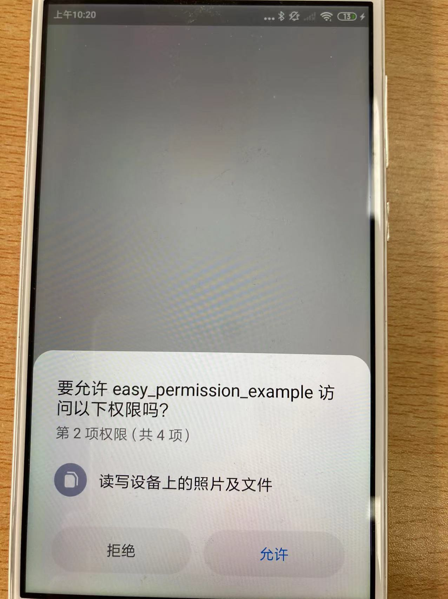

[中文](README.md) 
# easy_permission

Flutter permission Plugin

## description

This method can be used to apply for Flutter permission quickly and easily, eliminating the tedious lightweight permission application. If used with permission_handler, the result is much better.

## 效果如下


## How to use

```dart
Future<void> main() async {
  WidgetsFlutterBinding.ensureInitialized();
  await requestPermissions();
  runApp(MyApp());
}
Future<void> requestPermissions() async {
  if (Platform.isAndroid) {
    List<PermissionType> types = [];
    // 申请位置权限
    types.add(PermissionType.LOCATION);
    // 申请相机权限
    types.add(PermissionType.CAMERA);
    // 申请存储权限
    types.add(PermissionType.STORAGE);
    // 申请麦克风权限
    types.add(PermissionType.MICROPHONE);
    // 申请日历权限
    types.add(PermissionType.CALENDAR);
    await EasyPermission.requestPermissions(types);
  }
}
```

## Corresponding permissions

```dart
enum PermissionType {
  INTERNET,
  CALENDAR,
  CAMERA,
  CONTACTS,
  MICROPHONE,
  LOCATION,
  WHEN_IN_USE,
  PHONE,
  SENSORS,
  SMS,
  STORAGE,
  STATE,
}
```

## Note

### Android
Android permissions are divided into static permissions and dynamic permissions. This plug-in can only be used for dynamic permissions. You need to apply for static permissions in the Androidmanifest.xml file first

```xml
  <uses-permission android:name="android.permission.INTERNET" />
    <!--允许程序设置内置sd卡的读写权限-->
    <uses-permission android:name="android.permission.READ_EXTERNAL_STORAGE" />
    <uses-permission android:name="android.permission.WRITE_EXTERNAL_STORAGE" />
    <!--允许程序获取网络状态-->
    <uses-permission android:name="android.permission.ACCESS_NETWORK_STATE" />
    <!--允许程序访问WiFi网络信息-->
    <uses-permission android:name="android.permission.ACCESS_WIFI_STATE" />
    <!--允许程序读写手机状态和身份-->
    <uses-permission android:name="android.permission.READ_PHONE_STATE" />
    <!--允许程序访问CellID或WiFi热点来获取粗略的位置-->
    <uses-permission android:name="android.permission.ACCESS_COARSE_LOCATION" />
    <!--允许程序打开相机-->
    <uses-permission android:name="android.permission.CAMERA" />
    <!--允许程序打开本地相册-->
    <uses-permission android:name="android.permission.RECORD_AUDIO" />
    <!--用于访问GPS定位-->
    <uses-permission android:name="android.permission.ACCESS_FINE_LOCATION"/>
    <!--这个权限用于获取wifi的获取权限，wifi信息会用来进行网络定位-->
    <uses-permission android:name="android.permission.CHANGE_WIFI_STATE"/>
    <!--用于申请调用A-GPS模块-->
    <uses-permission android:name="android.permission.ACCESS_LOCATION_EXTRA_COMMANDS"/>
```

### iOS

Add the following configuration in info.plist of Runner directory in iOS directory: permission application must state that "XXX permission is required because of XXX function", and the description of "apply for permission to take photos because I need to take photos" cannot be written, which will be rejected by Appstore due to "metadata problems"

``` xml
<?xml version="1.0" encoding="UTF-8"?>
<!DOCTYPE plist PUBLIC "-//Apple//DTD PLIST 1.0//EN" "http://www.apple.com/DTDs/PropertyList-1.0.dtd">
<plist version="1.0">
<dict>
    ......
	<key>NSAppleMusicUsageDescription</key>
	<string>需要您提供多媒体访问权限</string>
	<key>NSCalendarsUsageDescription</key>
	<string>需要您提供日历信息，上传时间</string>
	<key>NSCameraUsageDescription</key>
	<string>需要您提供相机权限，才能拍照记录信息</string>
	<key>NSContactsUsageDescription</key>
	<string>需要您提供联系人，才能跟同事沟通</string>
	<key>NSLocationAlwaysAndWhenInUseUsageDescription</key>
	<string>需要您提供定位信息，才能使用定位记录您的正确工作轨迹</string>
	<key>NSLocationAlwaysUsageDescription</key>
	<string>需要您提供后台定位信息，才能使用巡检记录您的正确工作轨迹</string>
	<key>NSLocationUsageDescription</key>
	<string>需要您提供定位信息，才能使用巡检记录您的正确工作轨迹</string>
	<key>NSLocationWhenInUseUsageDescription</key>
	<string>需要您提供定位信息，才能使用巡检记录您的正确工作轨迹</string>
	<key>NSMotionUsageDescription</key>
	<string>需要您提供轨迹,才能使用巡检功能</string>
	<key>NSPhotoLibraryUsageDescription</key>
	<string>需要您提供相册访问权限，才能选择相册上传图片</string>
	<key>NSSpeechRecognitionUsageDescription</key>
	<string>需要您提供语音监听，才能使用功能</string>
</dict>
```

## usage scenario
It is recommended to use this plug-in in the main method to dynamically apply for necessary permissions, such as network and location.


## warnning
Before applying for permissions for the plug-in, use platform. isAndroid to check whether iOS permissions are dynamically applied for. You only need to statically declare permissions in info.plist